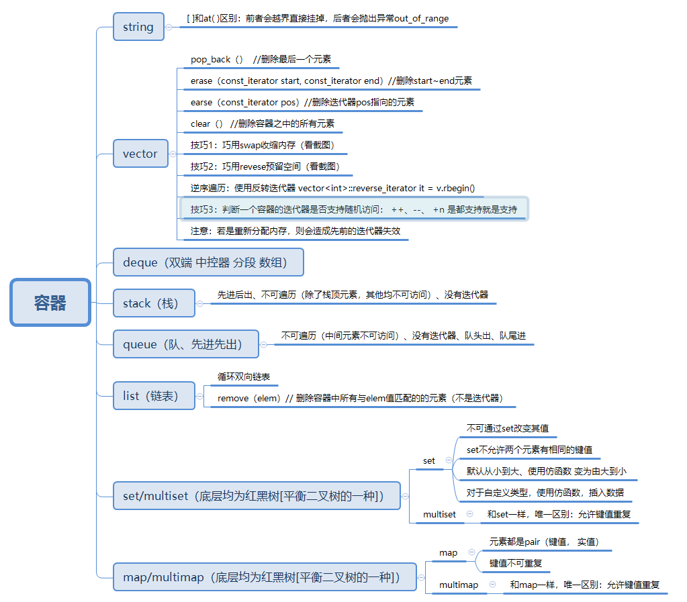

# STL 容器

&emsp;C++库以提供“模板”为主。所谓模板，是指不必预先制定类型的函数或类。我们可以借助STL（标准模板库 Standard Template Library,  STL）提供的高效算法来管理数据。为应对多种需求，STL为用户提供了多种名为容器（Container）的类，用于管理数据集合。在创建动态数组、表、栈、队列等数据结构时，我们只需要定义对应的容器，然后调用相应成员函数或算法即可。

&emsp;在C++标准中，STL被组织为下面的13个头文件：\<algorithm>、\<deque>、\<functional>、\<iterator>、\<vector>、\<list>、\<map>、\<memory.h>、\<numeric>、\<queue>、\<set>、\<stack>、\<utility>。

&emsp;STL可分为容器(containers)、迭代器(iterators)、空间配置器(allocator)、配接器(adapters)、算法(algorithms)、仿函数(functors)六个部分。




## 0. 基础

### 0.1 String 类

#### （1）简介

&emsp;要使用 string 类，必须包含头文件 <string>。string 库提供了许多其他功能，如删除字符串的部分或全部，用一个字符的部分或全部替换另一个字符串的部分或全部，插入、删除字符串中数据，比较、提取、复制、交换等。

#### （2） 函数

| 函数成员                        | 函数功能                     |
| ------------------------------- | ---------------------------- |
| 构造函数                        | 产生或复制字符串             |
| 析构函数                        | 销毁字符串                   |
| =，assign                       | 赋以新值                     |
| Swap                            | 交换两个字符串的内容         |
| +=，append( )，push_back()      | 添加字符                     |
| insert ()                       | 插入字符                     |
| erase()                         | 删除字符                     |
| clear ()                        | 移除全部字符                 |
| resize ()                       | 改变字符数量                 |
| replace()                       | 替换字符                     |
| +                               | 串联字符串                   |
| ==，!=，<，<=，>，>=，compare() | 比较字符串内容               |
| size()，length()                | 返回字符数量                 |
| max_size ()                     | 返回字符的最大可能个数       |
| empty ()                        | 判断字符串是否为空           |
| capacity ()                     | 返回重新分配之前的字符容量   |
| reserve()                       | 保留内存以存储一定数量的字符 |
| [], at()                        | 存取单一字符                 |
| >>，getline()                   | 从 stream 中读取某值         |
| <<                              | 将值写入 stream              |
| copy()                          | 将内容复制为一个 C - string  |
| c_str()                         | 将内容以 C - string 形式返回 |
| data()                          | 将内容以字符数组形式返回     |
| substr()                        | 返回子字符串                 |
| find()                          | 搜寻某子字符串或字符         |
| begin( )，end()                 | 提供正向迭代器支持           |
| rbegin()，rend()                | 提供逆向迭代器支持           |
| get_allocator()                 | 返回配置器                   |

> 构造函数

```cpp
string strs;                     //生成空字符串
string s(str);                   //生成字符串str的复制品
string s(str, stridx);           //将字符串str中始于stridx的部分作为构造函数的初值
string s(str, strbegin, strlen); //将字符串str中始于strbegin、长度为strlen的部分作为字符串初值
string s(cstr);                  //以C_string类型cstr作为字符串s的初值
string s(cstr, char_len);        //以C_string类型cstr的前char_len个字符串作为字符串s的初值
string s(num, c);                //生成一个字符串，包含num个c字符
string s(strs, beg, end);        //以区间[beg, end]内的字符作为字符串s的初值
```

> compare()函数

```cpp
int compare (const basic_string& s) const;
int compare (const Ch* p) const;
int compare (size_type pos, size_type n, const basic_string& s) const;
int compare (size_type pos, size_type n, const basic_string& s,size_type pos2, size_type n2) const;
int compare (size_type pos, size_type n, const Ch* p, size_type = npos) const;
```

> find()函数

```cpp
//find()函数的第1个参数是被搜索的字符、第2个参数是在源串中开始搜索的下标位置
size_type find (value_type _Chr, size_type _Off = 0) const;
//find()函数的第1个参数是被搜索的字符串，第2个参数是在源串中开始搜索的下标位置
size_type find (const value_type* _Ptr , size_type _Off = 0) const;
//第1个参数是被搜索的字符串，第2个参数是源串中开始搜索的下标，第3个参数是关于第1个参数的字符个数，可能是 _Ptr 的所有字符数，也可能是 _Ptr 的子串宇符个数
size_type find (const value_type* _Ptr, size_type _Off = 0, size_type _Count) const;
//第1个参数是被搜索的字符串，第2参数是在源串中开始搜索的下标位置
size_type find (const basic_string& _Str, size_type _Off = 0) const;
```


#### （3） 示例

```cpp
#include <iostream>
#include <string>
using namespace std;

int main() {
    string str  = "1234567";
    char   ch[] = "abcdefg";

    // 构造字符串
    string str0("ABCDEFG");              // 定义一个字符串
    string str1(str);                    // 构造函数，全部复制
    string str2(str, 2, 5);              // 构造函数，从字符串str的第2个元素开始，复制5个元素，赋值给str_2
    string str3(ch, 5);                  // 将字符串ch的前5个元素赋值给str_3
    string str4(5, 'X');                 // 将 5 个 'X' 组成的字符串 "XXXXX" 赋值给 str_4
    string str5(str.begin(), str.end()); // 复制字符串 str 的所有元素，并赋值给 str_5
    cout << str << endl;
    cout << str0 << endl;
    cout << str1 << endl;
    cout << str2 << endl;
    cout << str3 << endl;
    cout << str4 << endl;
    cout << str5 << endl;

    // 获取长度
    int    size       = 0;
    int    length     = 0;
    long   maxsize    = 0;
    int    capacity   = 0;
    string str_custom = str;
    str_custom.resize(5);
    size     = str_custom.size();
    length   = str_custom.length();
    maxsize  = str_custom.max_size();
    capacity = str_custom.capacity();
    cout << "size = " << size << endl;
    cout << "length = " << length << endl;
    cout << "maxsize = " << maxsize << endl;
    cout << "capacity = " << capacity << endl;

    // 获取字符
    char temp;
    char temp_1;
    temp   = str[2];    //"获取字符 'c'
    temp_1 = str.at(2); //获取字符 'c'
    cout << temp << " " << temp_1 << endl;

    // 查找
    string x("Hi, Peter, I'm sick. Please bought some drugs for me.");

    int p  = x.find('P');
    int rp = x.rfind('P');
    cout << "find() 查找的P在第 " << p << " 位" << endl;
    cout << "rfind()查找的P在第 " << rp << " 位" << endl;

    int q  = x.find("some", 0);
    int rq = x.rfind("some", 0);
    cout << "find() 查找的some在第 " << q << " 位" << endl;
    cout << "rfind()查找的some在第 " << rq << " 位" << endl;

    int l  = x.find(" drugs", 0, 5);
    int rl = x.rfind(" drugs", 0, 5);
    cout << "find() 查找的' drugs'在第 " << l << " 位" << endl;
    cout << "rfind()查找的' drugs'在第 " << rl << " 位" << endl;

    string y("sick");
    int    m  = x.find(y, 0);
    int    rm = x.rfind(y, 0);
    cout << "find() 查找的y字符串在第 " << m << " 位" << endl;
    cout << "rfind()查找的y字符串在第 " << rm << " 位" << endl;

    return 0;
}
```


### 参考资料零

(1) [C++ STL介绍——String类](https://www.cnblogs.com/lanxiang/p/11252404.html)


## 1. 序列式容器

### 1.1 vector（向量）

简单地说，vector是一个能够存放**任意类型**的**动态数组**，能够增加和压缩数据。

#### （1）头文件

```cpp
#include <vector>
```

#### （2）命名空间

vector 属于 std 命名域的，因此需要通过命名限定：

```cpp
using std::vector;
vector<int> vInts;

或者连在一起，使用全名：
std::vector<int> vInts;

建议在代码量不大，并且使用的命名空间不多的情况下，使用全局的命名域方式
using namespace std;
```

#### （3）vector 初始化

**方式1**

```cpp
//定义具有10个整型元素的向量（尖括号为元素类型名，它可以是任何合法的数据类型），不具有初值，其值不确定
vector<int> a(10);
```

**方式2**

```cpp
//定义具有10个整型元素的向量，且给出的每个元素初值为1
vector<int> a(10,1);
```

**方式3**

```cpp
//用向量b给向量a赋值，a的值完全等价于b的值
vector<int> a(b);
```

**方式4**

```cpp
//将向量b中从0-2（共三个）的元素赋值给a，a的类型为int型
vector<int> a(b.begin(),b.begin+3);
```

**方式5**

```cpp
//从数组中获得初值
int b[7]={1,2,3,4,5,6,7};
vector<int> a(b,b+7）;
```

#### （4）函数（举例说明）


```cpp
#include<vector>
vector<int> a,b;
//b为向量，将b的0-2个元素赋值给向量a
a.assign(b.begin(),b.begin()+3);
//a含有4个值为2的元素
a.assign(4,2);
//返回a的最后一个元素
a.back();
//返回a的第一个元素
a.front();
//返回a的第i元素,当且仅当a存在
a[i];
//清空a中的元素
a.clear();
//判断a是否为空，空则返回true，非空则返回false
a.empty();
//删除a向量的最后一个元素
a.pop_back();
//删除a中第一个（从第0个算起）到第二个元素，也就是说删除的元素从a.begin()+1算起（包括它）一直到a.begin()+3（不包括它）结束
a.erase(a.begin()+1,a.begin()+3);
//在a的最后一个向量后插入一个元素，其值为5
a.push_back(5);
//在a的第一个元素（从第0个算起）位置插入数值5,
a.insert(a.begin()+1,5);
//在a的第一个元素（从第0个算起）位置插入3个数，其值都为5
a.insert(a.begin()+1,3,5);
//b为数组，在a的第一个元素（从第0个元素算起）的位置插入b的第三个元素到第5个元素（不包括b+6）
a.insert(a.begin()+1,b+3,b+6);
//返回a中元素的个数
a.size();
//返回a在内存中总共可以容纳的元素个数
a.capacity();
//将a的现有元素个数调整至10个，多则删，少则补，其值随机
a.resize(10);
//将a的现有元素个数调整至10个，多则删，少则补，其值为2
a.resize(10,2);
//将a的容量扩充至100，
a.reserve(100);
//b为向量，将a中的元素和b中的元素整体交换
a.swap(b);
//b为向量，向量的比较操作还有 != >= > <= <
a==b;
```

#### （5）常用的算法

```cpp
#include<algorithm>
//对a中的从a.begin()（包括它）到a.end()（不包括它）的元素进行从小到大排列
sort(a.begin(),a.end());
//对a中的从a.begin()（包括它）到a.end()（不包括它）的元素倒置，但不排列，如a中元素为1,3,2,4,倒置后为4,2,3,1
reverse(a.begin(),a.end());
//把a中的从a.begin()（包括它）到a.end()（不包括它）的元素复制到b中，从b.begin()+1的位置（包括它）开始复制，覆盖掉原有元素
copy(a.begin(),a.end(),b.begin()+1);
//在a中的从a.begin()（包括它）到a.end()（不包括它）的元素中查找10，若存在返回其在向量中的位置
find(a.begin(),a.end(),10);
```


### 1.2 list （队列）

Lists将元素按顺序储存在链表中与向量(vectors)相比, 它允许快速的插入和删除，但是随机访问却比较慢。

#### （1）函数

| 函数成员        | 函数功能                       |
| --------------- | ------------------------------ |
| assign()        | 给list赋值                     |
| back()          | 返回最后一个元素               |
| begin()         | 返回指向第一个元素的迭代器     |
| clear()         | 删除所有元素                   |
| empty()         | 如果list是空的则返回true       |
| end()           | 返回末尾的迭代器               |
| erase()         | 删除一个元素                   |
| front()         | 返回第一个元素                 |
| get_allocator() | 返回list的配置器               |
| insert()        | 插入一个元素到list中           |
| max_size()      | 返回list能容纳的最大元素数量   |
| merge()         | 合并两个list                   |
| pop_back()      | 删除最后一个元素               |
| pop_front()     | 删除第一个元素                 |
| push_back()     | 在list的末尾添加一个元素       |
| push_front()    | 在list的头部添加一个元素       |
| rbegin()        | 返回指向第一个元素的逆向迭代器 |
| remove()        | 从list删除元素                 |
| remove_if()     | 按指定条件删除元素             |
| rend()          | 指向list末尾的逆向迭代器       |
| resize()        | 改变list的大小                 |
| reverse()       | 把list的元素倒转               |
| size()          | 返回list中的元素个数           |
| sort()          | 给list排序                     |
| splice()        | 合并两个list                   |
| swap()          | 交换两个list                   |
| unique()        | 删除list中重复的元素           |

#### （2）示例

```cpp
#include <iostream>
#include <list>
#include <vector>
using namespace std;

//从前向后显示list队列的全部元素
void put_list(list<int> List, char* name) {
    list<int>::iterator plist;

    cout << "The contents of " << name << " : ";
    for (plist = List.begin(); plist != List.end(); plist++) {
        cout << *plist << " ";
    }
    cout << endl;
}

//测试list容器的功能
int main() {
    //list1对象初始为空
    list<int> list1;
    char*     list1_name = (char*)"list1";
    //list2对象最初有10个值为6的元素
    list<int> list2(10, 6);
    char*     list2_name = (char*)"list2";
    //list3对象最初有3个元素
    vector<int> nums = {1, 2, 3, 4, 5, 6};
    list<int>   list3(nums.begin(), nums.begin() + 3);
    char*       list3_name = (char*)"list3";

    //声明一个名为i的双向迭代器
    list<int>::iterator i;

    //从前向后显示各list对象的元素
    put_list(list1, list1_name);
    put_list(list2, list2_name);
    put_list(list3, list3_name);

    //从list1序列后面添加两个元素
    list1.push_back(2);
    list1.push_back(4);
    cout << "list1.push_back(2) and list1.push_back(4):" << endl;
    put_list(list1, list1_name);

    //从list1序列前面添加两个元素
    list1.push_front(5);
    list1.push_front(7);
    cout << "list1.push_front(5) and list1.push_front(7):" << endl;
    put_list(list1, list1_name);

    //在list1序列中间插入数据
    list1.insert(++list1.begin(), 3, 9);
    cout << "list1.insert(list1.begin()+1,3,9):" << endl;
    put_list(list1, list1_name);

    //测试引用类函数
    cout << "list1.front()=" << list1.front() << endl;
    cout << "list1.back()=" << list1.back() << endl;

    //从list1序列的前后各移去一个元素
    list1.pop_front();
    list1.pop_back();
    cout << "list1.pop_front() and list1.pop_back():" << endl;
    put_list(list1, list1_name);

    //清除list1中的第2个元素
    list1.erase(++list1.begin());
    cout << "list1.erase(++list1.begin()):" << endl;
    put_list(list1, list1_name);

    //对list2赋值并显示
    list2.assign(8, 1);
    cout << "list2.assign(8,1):" << endl;
    put_list(list2, list2_name);

    //显示序列的状态信息
    cout << "list1.max_size(): " << list1.max_size() << endl;
    cout << "list1.size(): " << list1.size() << endl;
    cout << "list1.empty(): " << list1.empty() << endl;

    //list序列容器的运算
    put_list(list1, list1_name);
    put_list(list3, list3_name);
    cout << "list1>list3: " << (list1 > list3) << endl;
    cout << "list1<list3: " << (list1 < list3) << endl;

    //对list1容器排序
    list1.sort();
    put_list(list1, list1_name);

    //结合处理
    list1.splice(++list1.begin(), list3);
    put_list(list1, list1_name);
    put_list(list3, list3_name);

    return 0;
}
```


### 1.3 deque（**双端队列**） 

#### （1） 与 vector 比较

deque 容器和 vecotr 容器相同处：

- deque 容器也擅长在序列尾部添加或删除元素（时间复杂度为`O(1)`），而不擅长在序列中间添加或删除元素。
- deque 容器也可以根据需要修改自身的容量和大小。

deque 容器和 vecotr 容器不同处：

- deque 还擅长在序列头部添加或删除元素，所耗费的时间复杂度也为常数阶`O(1)`。
- deque 容器中存储元素并不能保证所有元素都存储到连续的内存空间中。

**当需要向序列两端频繁的添加或删除元素时，应首选 deque 容器。**

#### （2）函数

| 函数成员         | 函数功能                                                                                                   |
| ---------------- | ---------------------------------------------------------------------------------------------------------- |
| begin()          | 返回指向容器中第一个元素的迭代器。                                                                         |
| end()            | 返回指向容器最后一个元素所在位置后一个位置的迭代器，通常和 begin() 结合使用。                              |
| rbegin()         | 返回指向最后一个元素的迭代器。                                                                             |
| rend()           | 返回指向第一个元素所在位置前一个位置的迭代器。                                                             |
| cbegin()         | 和 begin() 功能相同，只不过在其基础上，增加了 const 属性，不能用于修改元素。                               |
| cend()           | 和 end() 功能相同，只不过在其基础上，增加了 const 属性，不能用于修改元素。                                 |
| crbegin()        | 和 rbegin() 功能相同，只不过在其基础上，增加了 const 属性，不能用于修改元素。                              |
| crend()          | 和 rend() 功能相同，只不过在其基础上，增加了 const 属性，不能用于修改元素。                                |
| size()           | 返回实际元素个数。                                                                                         |
| max_size()       | 返回容器所能容纳元素个数的最大值。这通常是一个很大的值，一般是 232-1，我们很少会用到这个函数。             |
| resize()         | 改变实际元素的个数。                                                                                       |
| empty()          | 判断容器中是否有元素，若无元素，则返回 true；反之，返回 false。                                            |
| shrink _to_fit() | 将内存减少到等于当前元素实际所使用的大小。                                                                 |
| at()             | 使用经过边界检查的索引访问元素。                                                                           |
| front()          | 返回第一个元素的引用。                                                                                     |
| back()           | 返回最后一个元素的引用。                                                                                   |
| assign()         | 用新元素替换原有内容。                                                                                     |
| push_back()      | 在序列的尾部添加一个元素。                                                                                 |
| push_front()     | 在序列的头部添加一个元素。                                                                                 |
| pop_back()       | 移除容器尾部的元素。                                                                                       |
| pop_front()      | 移除容器头部的元素。                                                                                       |
| insert()         | 在指定的位置插入一个或多个元素。                                                                           |
| erase()          | 移除一个元素或一段元素。                                                                                   |
| clear()          | 移出所有的元素，容器大小变为 0。                                                                           |
| swap()           | 交换两个容器的所有元素。                                                                                   |
| emplace()        | 在指定的位置直接生成一个元素。                                                                             |
| emplace_front()  | 在容器头部生成一个元素。和 push_front() 的区别是，该函数直接在容器头部构造元素，省去了复制移动元素的过程。 |
| emplace_back()   | 在容器尾部生成一个元素。和 push_back() 的区别是，该函数直接在容器尾部构造元素，省去了复制移动元素的过程。  |


#### （3）示例

```cpp
#include <deque>
#include <iostream>
using namespace std;

int main() {
    deque<int> d;
    d.push_back(10);
    d.push_back(20);
    d.push_back(30);
    cout << "原始双端队列：" << endl;
    for (int i = 0; i < d.size(); i++) {
        cout << d.at(i) << "\t";
    }
    cout << endl;
    d.push_front(5);
    d.push_front(3);
    d.push_front(1);

    cout << "after push_front(5.3.1):" << endl;
    for (int i = 0; i < d.size(); i++) {
        cout << d.at(i) << "\t";
    }
    cout << endl;
    d.pop_front();
    d.pop_front();
    cout << "after pop_front() two times:" << endl;
    for (int i = 0; i < d.size(); i++) {
        cout << d.at(i) << "\t";
    }
    cout << endl;
    return 0;
}
```


### 1.4 对比

 **vector ：** vector和built-in数组类似，拥有一段连续的内存空间，能非常好的支持随即存取，即[]操作符，但由于它的内存空间是连续的，所以在中间进行插入和删除会造成内存块的拷贝。当插入较多的元素后，预留内存空间可能不够，需要重新申请一块足够大的内存并把原来的数据拷贝到新的内存空间。这些影响了vector的效率，但是实际上用的最多的还是vector容器，建议大多数时候使用vector效率一般是不错的。

 **list：** list就是数据结构中的双向链表(根据sgi stl源代码)，因此它的内存空间是不连续的，通过指针来进行数据的访问，这个特点使得它的随即存取变的非常没有效率，因此它没有提供[]操作符的重载。但由于链表的特点，它可以以很好的效率支持任意地方的删除和插入。

 **deque：** deque是一个double-ended  queue，它具有以下两个特点：它支持[]操作符，也就是支持随即存取，并且和vector的效率相差无几，它支持在两端的操作：push_back,push_front,pop_back,pop_front等，并且在两端操作上与list的效率也差不多。


### 参考资料一

(1) [C++_vector操作](https://blog.csdn.net/weixin_41743247/article/details/90635931)

(2) [C++中list用法详解](https://blog.csdn.net/yas12345678/article/details/52601578/)

(3) [C++ STL deque容器（详解版）](http://c.biancheng.net/view/6860.html)


## 2. 适配器容器

### 2.1 stack（堆栈）

C++ Stack（堆栈） 是一个容器类的改编，实现了一个先进后出（FILO），也称作后进先出（LIFO）的数据结构。

#### （1）函数

| 函数成员  | 函数功能           |
| --------- | ------------------ |
| empty()   | 堆栈为空则返回真   |
| pop()     | 移除栈顶元素       |
| push()    | 在栈顶增加元素     |
| size()    | 返回栈中元素数目   |
| top()     | 返回栈顶元素       |
| emplace() | 在栈顶增加一个元素 |
| swap ()   | 交换两个栈中的内容 |

#### （2）示例

```cpp
#include <iostream>
#include <stack>
using namespace std;

void newstack(stack<int> ss) {
    stack<int> sg = ss;
    while (!sg.empty()) {
        cout << sg.top() << " ";
        sg.pop();
    }
    cout << endl;
}

int main() {
    stack<int> newst;
    newst.push(55);
    newst.push(44);
    newst.push(33);
    newst.push(22);
    newst.push(11);

    cout << "最新的堆栈是 : ";
    newstack(newst);
    cout << "\nnewst.size() : " << newst.size();
    cout << "\nnewst.top()  : " << newst.top();
    cout << "\nnewst.pop()  : ";
    newst.pop();
    newstack(newst);
    return 0;
}
```


### 2.2 queue（队列）

queue翻译为队列，在STL中主要则是实现了一个先进先出的容器。

#### （1）函数

| 函数成员  | 函数功能                                                                                                                   |
| --------- | -------------------------------------------------------------------------------------------------------------------------- |
| front()   | 返回 queue 中第一个元素的引用。如果 queue 是常量，就返回一个常引用；如果 queue 为空，返回值是未定义的                      |
| back()    | 返回 queue 中最后一个元素的引用。如果 queue 是常量，就返回一个常引用；如果 queue 为空，返回值是未定义的                    |
| push()    | 在 queue 的尾部添加一个元素的副本。这是通过调用底层容器的成员函数 push_back() 来完成的                                     |
| pop()     | 删除 queue 中的第一个元素                                                                                                  |
| size()    | 返回 queue 中元素的个数                                                                                                    |
| empty()   | 如果 queue 中没有元素的话，返回 true                                                                                       |
| emplace() | 用传给 emplace() 的参数调用 T 的构造函数，在 queue 的尾部生成对象                                                          |
| swap()    | 将当前 queue 中的元素和参数 queue 中的元素交换。它们需要包含相同类型的元素。也可以调用全局函数模板 swap() 来完成同样的操作 |

#### （2）示例

```cpp
#include <iostream>
#include <queue>

using namespace std;

int main() {
    queue<int> que_int;

    // 在队列末尾依次插入11，12，13
    que_int.push(11);
    que_int.push(12);
    que_int.push(13);

    // 获取队列中的最后一个元素
    int nValue1 = que_int.back();
    cout << "The last value of queue is: " << nValue1 << endl;

    // 获取队列中的第一个元素
    int nValue2 = que_int.front();
    cout << "The first value of queue is: " << nValue2 << endl;

    // 弹出队列中的第一个元素，之后再获取队列中的第一个元素
    que_int.pop();
    nValue2 = que_int.front();
    cout << "After pop, the first value of queue is: " << nValue2 << endl;

    // 返回队列中的元素个数
    int nSize = que_int.size();
    cout << "The size of queue is: " << nSize << endl;

    // 判断队列是否为空
    bool bFlag = que_int.empty();
    if (bFlag) {
        cout << "queue is empty." << endl;
    } else {
        cout << "queue is not empty." << endl;
    }

    // 清空队列
    que_int = queue<int>();

    // 判断队列是否为空
    bFlag = que_int.empty();
    if (bFlag) {
        cout << "After clear, queue is empty." << endl;
    } else {
        cout << "After clear, queue is not empty." << endl;
    }

    return 0;
}
```

### 2.3 priority_queue（优先队列）

保证每次的队首元素都是优先级最大的。可以用来解决一些贪心问题，也可以对 Dijkstra 算法进行优化（优先队列的本质是堆）。

#### （1）函数

与队列不同，优先队列只能通过 `top()` 函数来访问队首元素。

| 函数成员 | 函数功能                                              |
| -------- | ----------------------------------------------------- |
| push()   | 将 x 入队                                             |
| pop()    | 将队首元素出队                                        |
| top()    | 获得队首元素                                          |
| empty()  | 检测队列是否为空，返回 true 则为空，返回 false 则非空 |
| size()   | 返回队列中元素的个数                                  |

#### （2）示例

> 1) 基本使用

```cpp
#include <iostream>
#include <queue>
using namespace std;

int main() {
    priority_queue<int> q;
    //入队四个元素：3，4，1，5。默认情况下数字越大，优先级越大
    q.push(5);
    q.push(4);
    q.push(1);
    q.push(3);

    //出队队首元素：5
    q.pop();

    //访问队首元素
    printf("%d\n", q.top());

    //判断队列是否为空
    if (q.empty()) {
        printf("Empty\n");
    } else {
        printf("Not Empty\n");
    }

    //获取队列中剩余元素的个数
    printf("%d", q.size());
}
```

> 2) 优先级使用

若想实现价格低的水果优先级高，只需将 `return f1.price < f2.price;` 改为 `return f1.price > f2.price;` 即可。

```cpp
#include <iostream>
#include <queue>
using namespace std;

struct fruit {
    string name;
    int    price;
} f1, f2, f3;

struct cmp {
    bool operator()(fruit f1, fruit f2) {
        return f1.price < f2.price;
    }
};

int main() {
    priority_queue<fruit, vector<fruit>, cmp> q;
    f1.name  = "桃子";
    f1.price = 3;
    f2.name  = "梨子";
    f2.price = 4;
    f3.name  = "苹果";
    f3.price = 1;
    q.push(f1);
    q.push(f2);
    q.push(f3);
    cout << q.top().name << " " << q.top().price << endl;
    return 0;
}
```


### 参考资料二

(1) [C++ Stack（栈）](https://www.nhooo.com/cpp/cpp-stack.html)

(2) [STL之queue介绍](https://blog.csdn.net/liitdar/article/details/82529350)

(3) [极简教程：STL priority_queue](https://zhuanlan.zhihu.com/p/111734399)


## 3. 关联式容器

### 3.1 set/multiset（集合）

set 可实现 **自动递增排序** 并 **去除重复元素** 的功能。

#### （1）介绍

1. set是STL中一个很有用的容器，用来存储同一种数据类型的数据结构（可以称之为K的模型），基本功能与数组相似。 
2. set与数组不同的是，在set中每个元素的值都是唯一的。 
3. 而且set插入数据时，能够根据元素的值自动进行排序。 
4. set中数元素的值并不能直接被改变。

#### （2）set 底层

1. set的底层是红黑树，是红黑树里面K的模型；

> K模型：表示只能存放同一种数据类型 
> KV模型：表示能存放两种数据类型

2. map的底层也是红黑树，而它是KV模型。 
3. set不允许插入重复数据，而multiset允许插入相同的数据。

> 补充：multiset：multiset功能与set类似，接口也基本一样，最主要的区别是：set不允许数据冗余，而multiset允许数据冗余

#### （3）函数

| 函数成员         | 函数功能                                                                                                                                                                                                                                                                       |
| ---------------- | ------------------------------------------------------------------------------------------------------------------------------------------------------------------------------------------------------------------------------------------------------------------------------ |
| begin()          | 返回指向容器中第一个（注意，是已排好序的第一个）元素的双向迭代器。如果 set 容器用 const 限定，则该方法返回的是 const 类型的双向迭代器。                                                                                                                                        |
| end()            | 返回指向容器最后一个元素（注意，是已排好序的最后一个）所在位置后一个位置的双向迭代器，通常和 begin() 结合使用。如果 set 容器用 const 限定，则该方法返回的是 const 类型的双向迭代器。                                                                                           |
| rbegin()         | 返回指向最后一个（注意，是已排好序的最后一个）元素的反向双向迭代器。如果 set 容器用 const 限定，则该方法返回的是 const 类型的反向双向迭代器。                                                                                                                                  |
| rend()           | 返回指向第一个（注意，是已排好序的第一个）元素所在位置前一个位置的反向双向迭代器。如果 set 容器用 const 限定，则该方法返回的是 const 类型的反向双向迭代器。                                                                                                                    |
| cbegin()         | 和 begin() 功能相同，只不过在其基础上，增加了 const 属性，不能用于修改容器内存储的元素值。                                                                                                                                                                                     |
| cend()           | 和 end() 功能相同，只不过在其基础上，增加了 const 属性，不能用于修改容器内存储的元素值。                                                                                                                                                                                       |
| crbegin()        | 和 rbegin() 功能相同，只不过在其基础上，增加了 const 属性，不能用于修改容器内存储的元素值。                                                                                                                                                                                    |
| crend()          | 和 rend() 功能相同，只不过在其基础上，增加了 const 属性，不能用于修改容器内存储的元素值。                                                                                                                                                                                      |
| find(val)        | 在 set 容器中查找值为 val 的元素，如果成功找到，则返回指向该元素的双向迭代器；反之，则返回和 size() 方法一样的迭代器。另外，如果 set 容器用 const 限定，则该方法返回的是 const 类型的双向迭代器。                                                                              |
| lower_bound(val) | 返回一个指向当前 set 容器中第一个大于或等于 val 的元素的双向迭代器。如果 set 容器用 const 限定，则该方法返回的是 const 类型的双向迭代器。                                                                                                                                      |
| upper_bound(val) | 返回一个指向当前 set 容器中第一个大于 val 的元素的迭代器。如果 set 容器用 const 限定，则该方法返回的是 const 类型的双向迭代器。                                                                                                                                                |
| equal_range(val) | 该方法返回一个 pair 对象（包含 2 个双向迭代器），其中 pair.first 和 lower_bound()  方法的返回值等价，pair.second 和 upper_bound() 方法的返回值等价。也就是说，该方法将返回一个范围，该范围中包含的值为  val 的元素（set 容器中各个元素是唯一的，因此该范围最多包含一个元素）。 |
| empty()          | 若容器为空，则返回 true；否则 false。                                                                                                                                                                                                                                          |
| size()           | 返回当前 set 容器中存有元素的个数。                                                                                                                                                                                                                                            |
| max_size()       | 返回 set 容器所能容纳元素的最大个数，不同的操作系统，其返回值亦不相同。                                                                                                                                                                                                        |
| insert()         | 向 set 容器中插入元素。                                                                                                                                                                                                                                                        |
| erase()          | 删除 set 容器中存储的元素。                                                                                                                                                                                                                                                    |
| swap()           | 交换 2 个 set 容器中存储的所有元素。这意味着，操作的 2 个 set 容器的类型必须相同。                                                                                                                                                                                             |
| clear()          | 清空 set 容器中所有的元素，即令 set 容器的 size() 为 0。                                                                                                                                                                                                                       |
| emplace()        | 在当前 set 容器中的指定位置直接构造新元素。其效果和 insert() 一样，但效率更高。                                                                                                                                                                                                |
| emplace_hint()   | 在本质上和 emplace() 在 set 容器中构造新元素的方式是一样的，不同之处在于，使用者必须为该方法提供一个指示新元素生成位置的迭代器，并作为该方法的第一个参数。                                                                                                                     |
| count(val)       | 在当前 set 容器中，查找值为 val 的元素的个数，并返回。注意，由于 set 容器中各元素的值是唯一的，因此该函数的返回值最大为 1。                                                                                                                                                    |

#### （4）示例

```cpp
#include <iostream>
#include <set>
using namespace std;

void display(set<int> st) {
    if (st.empty()) {
        cout << "set is empty" << endl;
        return;
    }

    for (auto i : st) {
        cout << i << " ";
    }
    cout << endl;
}

int main() {
    set<int> st;

    // 添加
    st.insert(1);
    st.insert(3);
    st.insert(4);
    st.insert(5);
    cout << "初始集合为：";
    display(st);

    // 查找，查找不到返回 集合大小
    set<int>::iterator it = st.find(2); // 在set中查找2,返回其迭代器
    cout << *it << endl;

    // 删除一个元素
    st.erase(4);
    cout << "删除元素集合为：";
    display(st);

    // 求集合大小
    cout << st.size() << endl;

    // 清空集合
    st.clear();
    cout << "清空集合为：";
    display(st);

    return 0;
}
```


### 3.2 map/multimap（映射）

#### （1）介绍

&emsp;Map是STL的一个关联容器，它提供一对一（其中第一个可以称为关键字，每个关键字只能在map中出现一次，第二个可能称为该关键字的值）的数据处理能力，由于这个特性，它完成有可能在我们处理一对一数据的时候，在编程上提供快速通道。

&emsp;map内部自建一颗红黑树(一 种非严格意义上的平衡二叉树)，这颗树具有对数据自动排序的功能，所以在map内部所有的数据都是有序的。

#### （2）函数

| 函数成员         | 函数功能                                                                                                                                                                                                                                                                   |
| ---------------- | -------------------------------------------------------------------------------------------------------------------------------------------------------------------------------------------------------------------------------------------------------------------------- |
| begin()          | 返回指向容器中第一个（注意，是已排好序的第一个）键值对的双向迭代器。如果 map 容器用 const 限定，则该方法返回的是 const 类型的双向迭代器。                                                                                                                                  |
| end()            | 返回指向容器最后一个元素（注意，是已排好序的最后一个）所在位置后一个位置的双向迭代器，通常和 begin() 结合使用。如果 map 容器用 const 限定，则该方法返回的是 const 类型的双向迭代器。                                                                                       |
| rbegin()         | 返回指向最后一个（注意，是已排好序的最后一个）元素的反向双向迭代器。如果 map 容器用 const 限定，则该方法返回的是 const 类型的反向双向迭代器。                                                                                                                              |
| rend()           | 返回指向第一个（注意，是已排好序的第一个）元素所在位置前一个位置的反向双向迭代器。如果 map 容器用 const 限定，则该方法返回的是 const 类型的反向双向迭代器。                                                                                                                |
| cbegin()         | 和 begin() 功能相同，只不过在其基础上，增加了 const 属性，不能用于修改容器内存储的键值对。                                                                                                                                                                                 |
| cend()           | 和 end() 功能相同，只不过在其基础上，增加了 const 属性，不能用于修改容器内存储的键值对。                                                                                                                                                                                   |
| crbegin()        | 和 rbegin() 功能相同，只不过在其基础上，增加了 const 属性，不能用于修改容器内存储的键值对。                                                                                                                                                                                |
| crend()          | 和 rend() 功能相同，只不过在其基础上，增加了 const 属性，不能用于修改容器内存储的键值对。                                                                                                                                                                                  |
| find(key)        | 在 map 容器中查找键为 key 的键值对，如果成功找到，则返回指向该键值对的双向迭代器；反之，则返回和 end() 方法一样的迭代器。另外，如果 map 容器用 const 限定，则该方法返回的是 const 类型的双向迭代器。                                                                       |
| lower_bound(key) | 返回一个指向当前 map 容器中第一个大于或等于 key 的键值对的双向迭代器。如果 map 容器用 const 限定，则该方法返回的是 const 类型的双向迭代器。                                                                                                                                |
| upper_bound(key) | 返回一个指向当前 map 容器中第一个大于 key 的键值对的迭代器。如果 map 容器用 const 限定，则该方法返回的是 const 类型的双向迭代器。                                                                                                                                          |
| equal_range(key) | 该方法返回一个 pair 对象（包含 2 个双向迭代器），其中 pair.first 和 lower_bound()  方法的返回值等价，pair.second 和 upper_bound() 方法的返回值等价。也就是说，该方法将返回一个范围，该范围中包含的键为  key 的键值对（map 容器键值对唯一，因此该范围最多包含一个键值对）。 |
| empty()          | 若容器为空，则返回 true；否则 false。                                                                                                                                                                                                                                      |
| size()           | 返回当前 map 容器中存有键值对的个数。                                                                                                                                                                                                                                      |
| max_size()       | 返回 map 容器所能容纳键值对的最大个数，不同的操作系统，其返回值亦不相同。                                                                                                                                                                                                  |
| operator[]       | map容器重载了 [] 运算符，只要知道 map 容器中某个键值对的键的值，就可以向获取数组中元素那样，通过键直接获取对应的值。                                                                                                                                                       |
| at(key)          | 找到 map 容器中 key 键对应的值，如果找不到，该函数会引发 out_of_range 异常。                                                                                                                                                                                               |
| insert()         | 向 map 容器中插入键值对。                                                                                                                                                                                                                                                  |
| erase()          | 删除 map 容器指定位置、指定键（key）值或者指定区域内的键值对。后续章节还会对该方法做重点讲解。                                                                                                                                                                             |
| swap()           | 交换 2 个 map 容器中存储的键值对，这意味着，操作的 2 个键值对的类型必须相同。                                                                                                                                                                                              |
| clear()          | 清空 map 容器中所有的键值对，即使 map 容器的 size() 为 0。                                                                                                                                                                                                                 |
| emplace()        | 在当前 map 容器中的指定位置处构造新键值对。其效果和插入键值对一样，但效率更高。                                                                                                                                                                                            |
| emplace_hint()   | 在本质上和 emplace() 在 map 容器中构造新键值对的方式是一样的，不同之处在于，使用者必须为该方法提供一个指示键值对生成位置的迭代器，并作为该方法的第一个参数。                                                                                                               |
| count(key)       | 在当前 map 容器中，查找键为 key 的键值对的个数并返回。注意，由于 map 容器中各键值对的键的值是唯一的，因此该函数的返回值最大为 1。                                                                                                                                          |

#### （3）示例

```cpp
#include <iostream>
#include <map>
#include <string.h>
using namespace std;

void display(map<int, string> Map) {
    if (Map.empty()) {
        cout << "map is empty" << endl;
        return;
    }

    for (auto i : Map) {
        cout << i.first << ": " << i.second << endl;
    }
    cout << endl;
}

int main() {
    map<int, string> Employees;
    // 使用数组索引符号进行赋值
    Employees[101] = "Nikita";
    Employees[105] = "John";
    Employees[103] = "Dolly";
    Employees[102] = "Aman";
    Employees[104] = "Deep";
    // 插入
    Employees.insert(make_pair(99, "Marry"));

    // begin 遍历
    cout << "自然顺序:" << endl;
    for (map<int, string>::iterator ii = Employees.begin(); ii != Employees.end(); ++ii) {
        cout << (*ii).first << ": " << (*ii).second << endl;
    }
    cout << endl;

    // rbegin 遍历
    cout << "相反顺序:" << endl;
    for (map<int, string>::reverse_iterator ii = Employees.rbegin(); ii != Employees.rend(); ++ii) {
        cout << (*ii).first << ": " << (*ii).second << endl;
    }
    cout << endl;

    // 查找
    cout << Employees.count(99) << endl;
    cout << Employees.at(99) << endl;

    // 删除
    cout << Employees.erase(99) << endl;
    display(Employees);

    // 清空
    Employees.clear();
    display(Employees);

    return 0;
}
```


### 3.3 pair（键值对）

当想要将两个元素绑在一起作为一个合成元素、又不想定义结构体时，可以用 pair 作为结构体的替代品，可以节省编码时间。

#### （1）说明

pair 类模板定义在`<utility> 或者 <map>` 头文件中，所以在使用该类模板之前，需引入此头文件。另外值得一提的是，在 C++ 11 标准之前，pair 类模板中提供了以下 3 种构造函数：

```cpp
#1) 默认构造函数，即创建空的 pair 对象
pair();
#2) 直接使用 2 个元素初始化成 pair 对象
pair (const first_type& a, const second_type& b);
#3) 拷贝（复制）构造函数，即借助另一个 pair 对象，创建新的 pair 对象
template<class U, class V> pair (const pair<U,V>& pr);
```

在 C++ 11 标准中，在引入[右值引用](http://c.biancheng.net/view/439.html)的基础上，pair 类模板中又增添了如下 2 个构造函数：

```cpp
#4) 移动构造函数
template<class U, class V> pair (pair<U,V>&& pr);
#5) 使用右值引用参数，创建 pair 对象
template<class U, class V> pair (U&& a, V&& b);
```

#### （2）比较操作 

两个 pair 类型数据可以直接使用比较运算符进行比较。比较规则是**先以 first 的大小作为标准，first 相等时才判别 second 的大小。**

> ==，！=，<，<，<=，>，>=

#### （3）示例

```cpp
#include <iostream>
#include <map>
using namespace std;

int main() {
    pair<string, int> p1;
    pair<string, int> p2;
    pair<string, int> p3;

    // 创建方式第一种
    p1.first  = "young";
    p1.second = 3;
    // 第二种
    p2 = make_pair("simple", 0);
    // 第三种
    p3 = pair<string, int>("naive", 1);

    cout << p1.first << " " << p1.second << endl;
    cout << p2.first << " " << p2.second << endl;
    cout << p3.first << " " << p3.second << endl;

    // 比较
    pair<int, int> p11(5, 10);
    pair<int, int> p22(5, 15);
    pair<int, int> p33(10, 5);

    if (p11 < p22) {
        cout << "p11 < p22" << endl;
    }
    if (p11 < p33) {
        cout << "p11 < p33" << endl;
    }

    return 0;
}
```


### 参考资料三

(1) [STL中的set使用方法详细](https://blog.csdn.net/changjiale110/article/details/79108447)

(2) [C++ map 使用方法及示例](https://www.nhooo.com/cpp/cpp-map.html)

(3) [极简教程：STL pair](https://zhuanlan.zhihu.com/p/112211280)


## 4. 无序关联式容器

这类容器对存储数据不会进行排序。

### 4.1 unordered_set

总的来说，unordered_set 容器具有以下几个特性：

1. 不再以键值对的形式存储数据，而是直接存储数据的值；
2. 容器内部存储的各个元素的值都互不相等，且不能被修改。
3. 不会对内部存储的数据进行排序

### 4.2 unordered_map

&emsp;unordered_map 容器和 map 容器一样，以键值对（pair类型）的形式存储数据，存储的各个键值对的键互不相同且不允许被修改。但由于 unordered_map 容器底层采用的是哈希表存储结构，该结构本身不具有对数据的排序功能，所以此容器内部不会自行对存储的键值对进行排序。